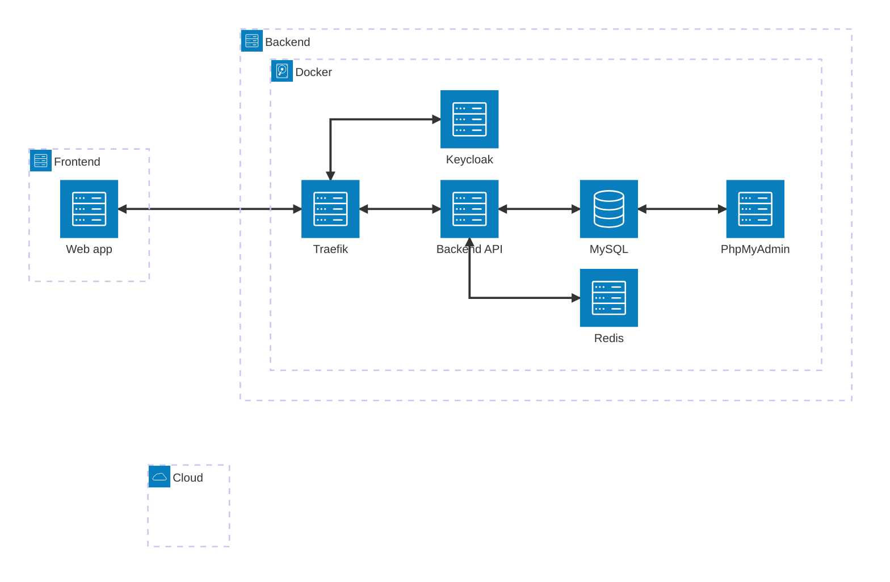

# BEMED

## Architecture

```mermaid
architecture-beta
    group cloud(cloud)[Cloud]

    group frontend(server)[Frontend]
    service web(server)[Web app] in frontend

    group backend(server)[Backend]
    group docker(disk)[Docker] in backend
    service db(database)[MySQL] in docker
    service keycloak(server)[Keycloak] in docker
    service api(server)[Backend API] in docker
    service traefik(server)[Traefik] in docker
    service redis(server)[Redis] in docker
    service phpmyadmin(server)[PhpMyAdmin] in docker

    web:R <--> L:traefik
    traefik:R <--> L:api
    traefik:T <--> L:keycloak
    api:R <--> L:db
    api:B <--> L:redis
    db:R <--> L:phpmyadmin
```
