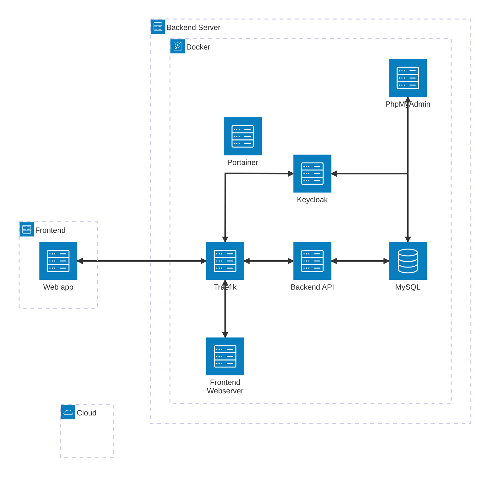

# BEMED

## Architecture

```mermaid
architecture-beta
    group cloud(cloud)[Cloud]

    group frontend(server)[Frontend]
    service web(server)[Web app] in frontend

    group backend(server)[Backend Server]
    group docker(disk)[Docker] in backend
    service db(database)[MySQL] in docker
    service keycloak(server)[Keycloak] in docker
    service api(server)[Backend API] in docker
    service webserver(server)[Frontend Webserver] in docker
    service traefik(server)[Traefik] in docker
    service portainer(server)[Portainer] in docker
    service phpmyadmin(server)[PhpMyAdmin] in docker

    junction dbjunction in docker

    web:R <--> L:traefik
    traefik:R <--> L:api
    traefik:T <--> L:keycloak
    api:R <--> L:db
    db:T <-- B:dbjunction
    phpmyadmin:B <-- T:dbjunction
    keycloak:R <-- L:dbjunction
    traefik:B <--> T:webserver
```
