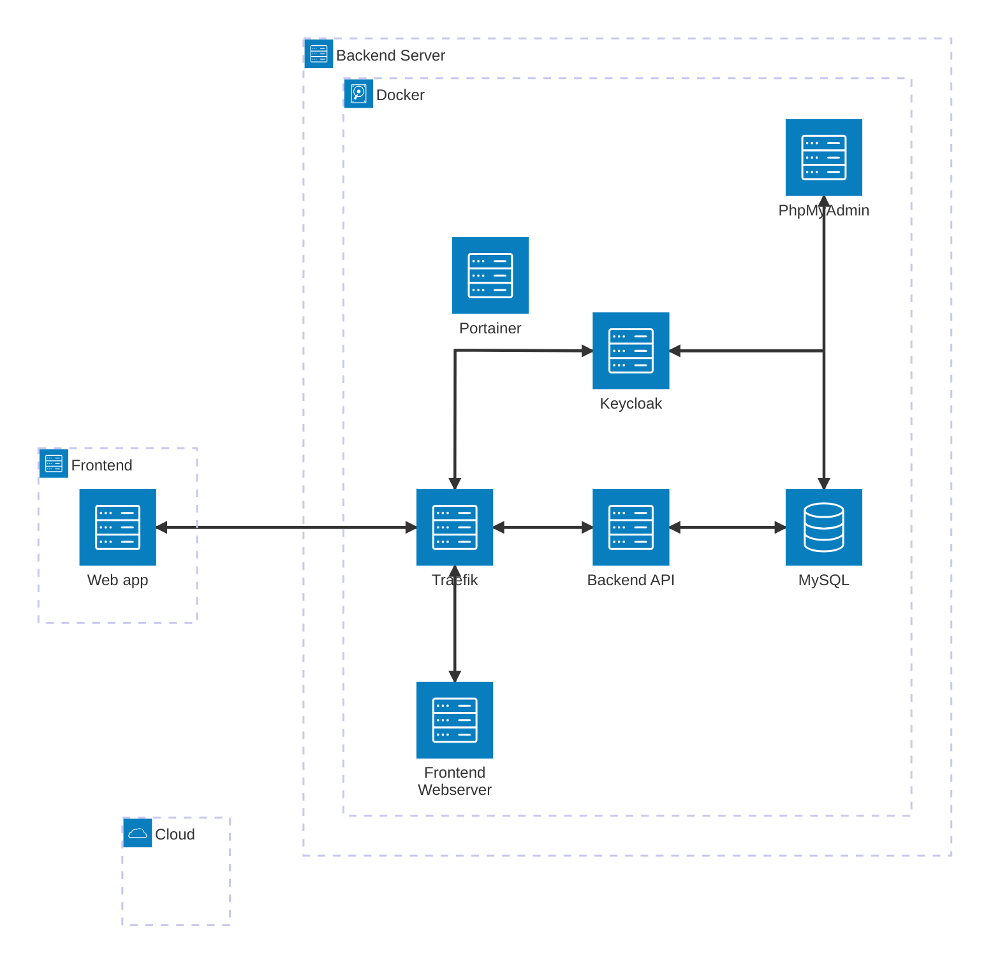

# BEMED - Zero Waste Management System

BEMED is a comprehensive solution designed to help institutions assess and improve their waste management practices. The system provides tools for waste treatment assessments, product usage tracking, and discovering environmentally friendly alternatives to single-use products.

## Features

- **Waste Management Assessment**: Interactive surveys to evaluate current waste management practices
- **Product Usage Tracking**: Monitor consumption of single-use products
- **Alternative Products**: Discover and compare environmentally friendly alternatives
- **Environmental Impact Metrics**: Track the environmental footprint reduction through improved practices
- **Authentication & Authorization**: Secure user management through Keycloak integration
- **Responsive Interface**: Mobile-friendly design that works across devices

## Architecture

BEMED follows a microservice architecture approach, utilizing Docker containers orchestrated via Docker Compose:

- **Frontend**: Vue.js 3 application with Vuetify for UI components
- **Backend**: Node.js REST API built with Express
- **Authentication**: Keycloak for identity and access management
- **Database**: MariaDB for data storage
- **Reverse Proxy**: Traefik for routing and load balancing
- **Administration Tools**: Portainer for container management and PHPMyAdmin for database administration



## Getting Started

### Prerequisites

- Docker and Docker Compose
- Node.js 18+ (for local development)
- A modern web browser

### Installation

1. Clone the repository:

   ```bash
   git clone https://github.com/SimonStnn/BEMED.git
   cd BEMED
   ```

2. Create a `.env` file in the root directory with the following configuration:

   ```conf
   # Domain configuration
   BEMED_DOMAIN=localhost
   DNS_PREFIX_KEYCLOAK=keycloak
   DNS_PREFIX_BEMED_BACKEND=api
   DNS_PREFIX_BEMED_FRONTEND=app
   BEMED_PROTOCOL=http
   NODE_ENV=development

   # API configuration
   BEMED_API_PORT=3000

   # Database configuration
   MARIADB_ROOT_PASSWORD=your_secure_password

   # Keycloak configuration
   KC_BOOTSTRAP_ADMIN_USERNAME=admin
   KC_BOOTSTRAP_ADMIN_PASSWORD=strong_password
   KC_DB_USERNAME=keycloak
   KC_DB_PASSWORD=keycloak_db_password
   KC_DB_NAME=keycloak

   # Client configuration
   KEYCLOAK_REALM=BEMED
   KEYCLOAK_BACKEND_CLIENT_ID=backend
   KEYCLOAK_FRONTEND_CLIENT_ID=frontend
   KEYCLOAK_CLIENT_SECRET=your_client_secret
   ```

3. Start the application using Docker Compose:

   ```bash
   docker-compose up -d
   ```

4. Access the application at <http://app.localhost>

### Development Setup

For development work:

1. Install backend dependencies:

   ```bash
   cd backend
   npm install
   ```

2. Install frontend dependencies:

   ```bash
   cd frontend
   npm install
   ```

3. Run backend in development mode:

   ```bash
   cd backend
   npm run dev
   ```

4. Run frontend in development mode:

   ```bash
   cd frontend
   npm run dev
   ```

## Accessing Services

After deployment, the following services are available:

- **Frontend**: <http://app.localhost>
- **Backend API**: <http://api.localhost>
- **API Documentation**: <http://api.localhost/docs>
- **Documentation**: <http://docs.localhost>
- **Keycloak Admin**: <http://keycloak.localhost/admin>
- **PHPMyAdmin**: <http://phpmyadmin.localhost>
- **Portainer**: <http://localhost:9000>
- **Traefik Dashboard**: <http://traefik.localhost:8080>

## Documentation

Comprehensive documentation is available at <http://docs.localhost> after deployment, including:

- **Getting Started Guide**: For system administrators
- **Backend API Documentation**: Details on available API endpoints
- **Frontend Documentation**: Information about the user interface
- **Docker Services Documentation**: Configuration details for each service
