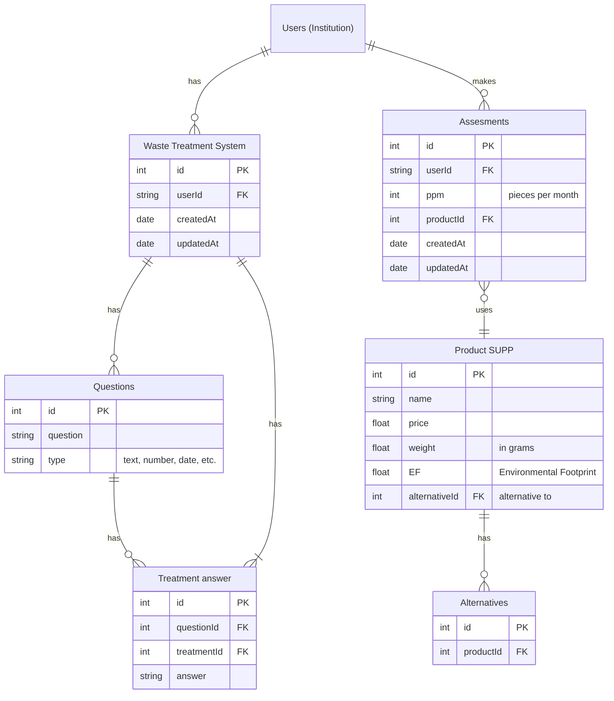

# Backend

## Entity Relationship Diagram

```mermaid
erDiagram
users["Users (Institution)"] {}

treatments["Waste Treatment System"] {
    int id PK
    string userId FK
    date createdAt
    date updatedAt
}

questions["Questions"] {
    int id PK
    string question
    string type "text, number, date, etc."
}

answer["Treatment answer"] {
    int id PK
    int questionId FK
    int treatmentId FK
    string answer
}

assesments["Assesments"] {
    int id PK
    string userId FK
    int ppm "pieces per month"
    int productId FK
    date createdAt
    date updatedAt
}

products["Product SUPP"] {
    int id PK
    string name
    float price 
    float weight "in grams"
    float EF "Environmental Footprint"
    int alternativeId FK "alternative to"
}

alternatives["Alternatives"] {
    int id PK
    int productId FK
}

users ||--o{ treatments : "has"
treatments ||--o{ questions : "has"
questions ||--o{ answer : "has"
treatments ||-- |{ answer : "has"
users ||--o{   assesments : "makes"
products ||--o{ alternatives : "has"
assesments }o--|| products : "uses"
```
