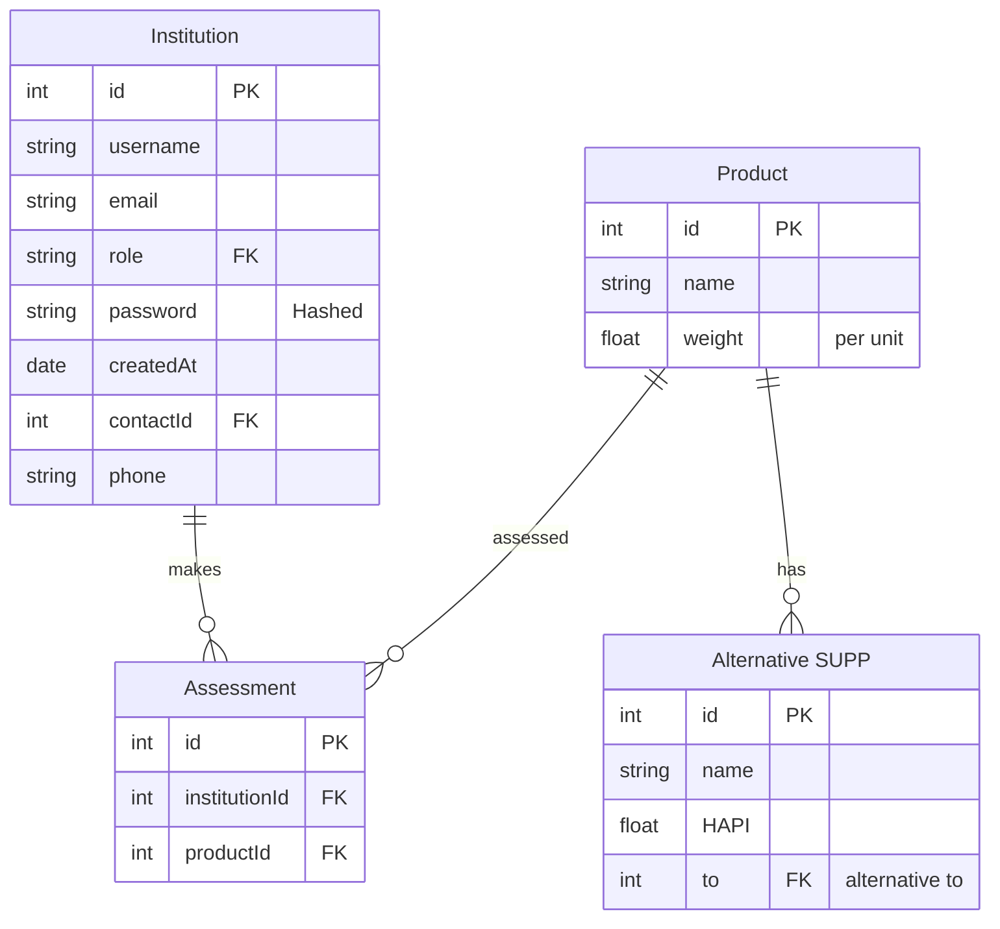

# Backend

## Entity Relationship Diagram

```mermaid
erDiagram
Institution {
    int id PK
    string username 
    string email
    string role FK
    string password "Hashed"
    date createdAt
    int contactId FK
    string phone
}

Product {
    int id PK
    string name
    float weight "per unit"
}

Alternative["Alternative SUPP"] {
    int id PK
    string name
    float HAPI
    int to FK "alternative to"
}

Assessment {
    int id PK
    int institutionId FK
    int productId FK
}

Institution ||--o{ Assessment : "makes"
Product ||--o{ Assessment : "assessed"
Product ||--o{ Alternative : "has"
```
