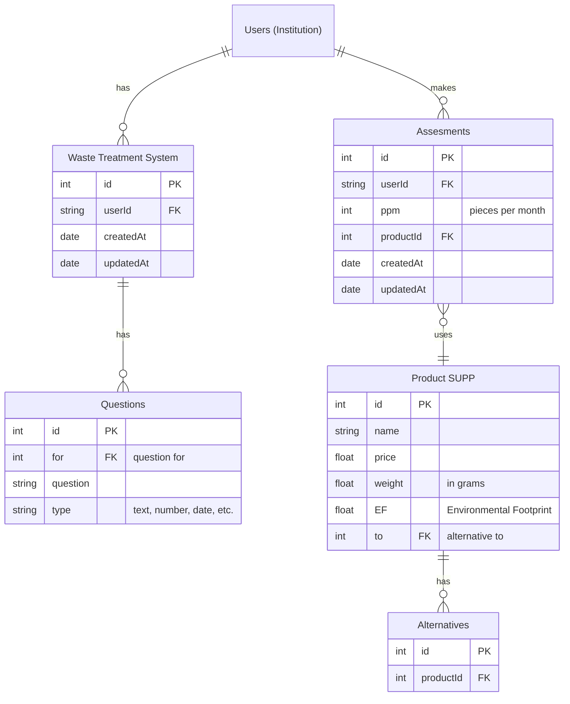

# Backend

## Entity Relationship Diagram

```mermaid
erDiagram
Users["Users (Institution)"] {}

Treatments["Waste Treatment System"] {
    int id PK
    string userId FK
    date createdAt
    date updatedAt
}

Questions {
    int id PK
    int for FK "question for"
    string question
    string type "text, number, date, etc."
}

Assesments {
    int id PK
    string userId FK
    int ppm "pieces per month"
    int productId FK
    date createdAt
    date updatedAt
}

Products["Product SUPP"] {
    int id PK
    string name
    float price 
    float weight "in grams"
    float EF "Environmental Footprint"
    int to FK "alternative to"
}

Alternatives {
    int id PK
    int productId FK
}

Treatments ||--o{ Questions : "has"
Users ||--o{ Treatments : "has"
Users ||--o{ Assesments : "makes"
Products ||--o{ Alternatives : "has"
Assesments }o--|| Products : "uses"
```
