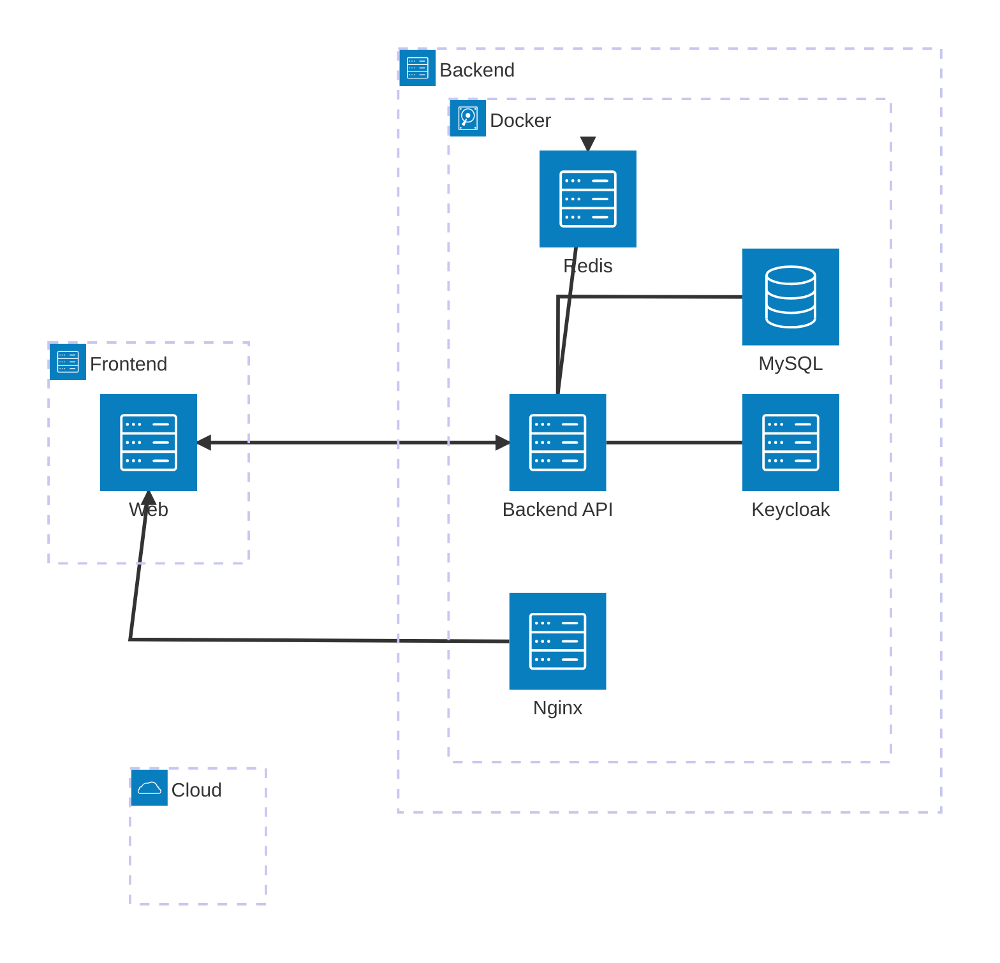
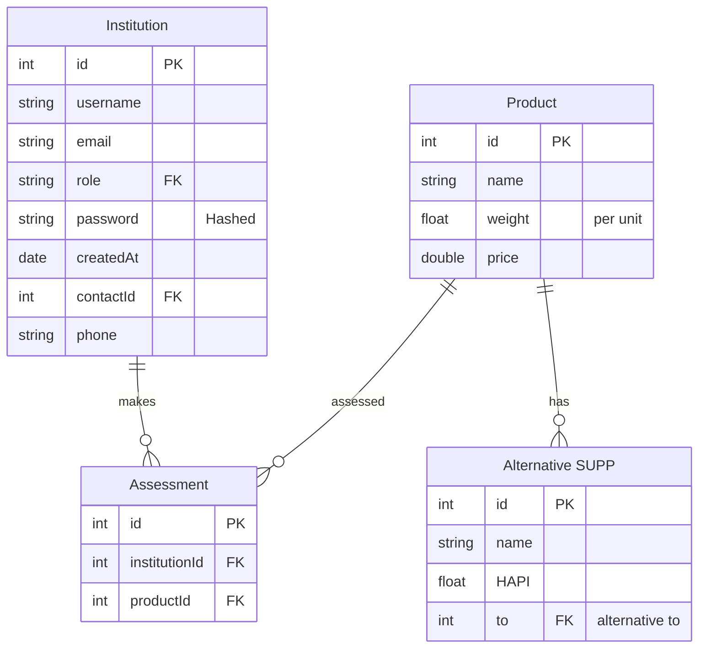

# Backend

## Architecture

```mermaid
architecture-beta
    group cloud(cloud)[Cloud]

    group frontend(server)[Frontend]
    service web(server)[Web] in frontend

    group backend(server)[Backend]
    group docker(disk)[Docker] in backend
    service db(database)[MySQL] in docker
    service keycloak(server)[Keycloak] in docker
    service api(server)[Backend API] in docker
    service nginx(server)[Nginx] in docker
    service redis(server)[Redis] in docker

    web:B <-- L:nginx
    web:R <--> L:api
    api:T --> T:redis
    api:T -- L:db
    api:R -- L:keycloak
```

## Entity Relationship Diagram

```mermaid
erDiagram
Institution {
    int id PK
    string username 
    string email
    string role FK
    string password "Hashed"
    date createdAt
    int contactId FK
    string phone
}

Product {
    int id PK
    string name
    float weight "per unit"
    double price
}

Alternative["Alternative SUPP"] {
    int id PK
    string name
    float HAPI
    int to FK "alternative to"
    
}

Assessment {
    int id PK
    int institutionId FK
    int productId FK
}

Institution ||--o{ Assessment : "makes"
Product ||--o{ Assessment : "assessed"
Product ||--o{ Alternative : "has"
```
