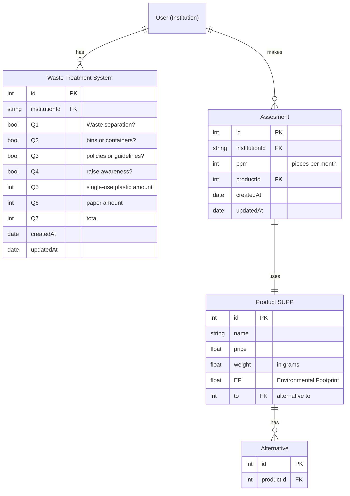

# Backend

## Entity Relationship Diagram

```mermaid
erDiagram
User["User (Institution)"] {}

Treatment["Waste Treatment System"] {
    int id PK
    string institutionId FK
    bool Q1 "Waste separation?"
    bool Q2 "bins or containers?"
    bool Q3 "policies or guidelines?"
    bool Q4 "raise awareness?"
    int Q5 "single-use plastic amount"
    int Q6 "paper amount"
    int Q7 "total"
    date createdAt
    date updatedAt
}

Assesment {
    int id PK
    string institutionId FK
    int ppm "pieces per month"
    int productId FK
    date createdAt
    date updatedAt
}

Product["Product SUPP"] {
    int id PK
    string name
    float price 
    float weight "in grams"
    float EF "Environmental Footprint"
    int to FK "alternative to"
}

Alternative {
    int id PK
    int productId FK
}

User ||--o{ Treatment : "has"
User ||--o{ Assesment : "makes"
Product ||--o{ Alternative : "has"
Assesment ||--|| Product : "uses"
```
