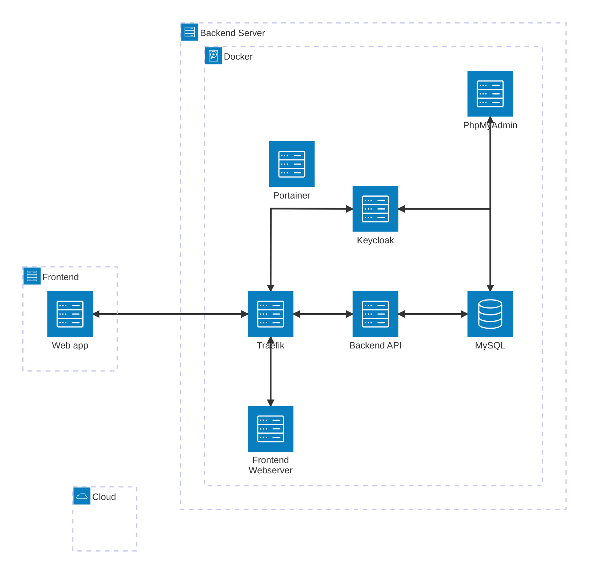
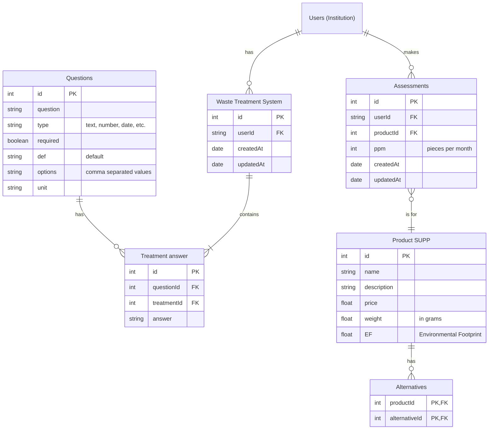

# BEMED - Zero Waste Management System

## Overview

BEMED is a comprehensive web application focused on waste management and environmental impact assessment. The project aims to raise awareness and influence changes in laws and behaviors to reduce waste production and stop littering in Montenegro.

The system provides tools for tracking treatments, products, assessments, and alternatives to single-use products, supporting the global ecological transition with respect for human rights and consideration of future generations.

## Architecture

The BEMED system follows a microservice architecture approach, utilizing Docker containers orchestrated via Docker Compose:

- **Frontend**: Vue.js 3 application with Vuetify for UI components
- **Backend**: Node.js REST API built with Express
- **Authentication**: Keycloak for identity and access management
- **Database**: MariaDB for data storage
- **Reverse Proxy**: Traefik for routing and load balancing
- **Administration Tools**: Portainer for container management and PHPMyAdmin for database administration

### Architecture Diagram



## Backend

The backend service provides a RESTful API built with Node.js and Express, handling data operations for waste treatments, products, and assessments.

### Data Models

The backend follows a structured data model represented by the following Entity Relationship Diagram:



### Key Components

#### Controllers

The backend implements several controller classes:

1. **AssessmentController**: Manages product assessments, tracking metrics like pieces per month (ppm)
2. **ProductController**: Handles product data and their environmental alternatives
3. **TreatmentController**: Manages waste treatment systems and their associated survey answers

#### Routes

API endpoints are organized into the following route groups:

1. **/assessment**: Routes for creating and retrieving assessment data
2. **/docs**: Swagger UI for API documentation
3. **/product**: Routes for product management
4. **/treatment**: Routes for managing waste treatment systems and their survey data

#### Middleware

The backend uses several middleware components:

1. **Logging**: Records API requests for debugging and monitoring
2. **Error Handling**: Centralized error handling for consistent error responses
3. **Authentication**: Keycloak integration for securing API endpoints
4. **CORS**: Cross-Origin Resource Sharing support for frontend integration

## Frontend

The frontend is a Vue.js 3 application using the Composition API, Vuetify for UI components, and TypeScript for type safety.

### Key Features

1. **Home View**: Introduction to BEMED's zero waste mission
2. **Survey View**: Interactive questionnaire for waste management practices
3. **Alternatives View**: Displays environmentally friendly alternatives to single-use products

### Components

1. **ApiForm**: Reusable component for API interactions
2. **ProfileMenu**: User account and profile management

### Stores

1. **Auth Store**: Manages authentication state using Pinia

## Docker Services

### Traefik

- **Purpose**: Reverse proxy and load balancer
- **Configuration**: Located in `/config/traefik/`
- **Ports**: 80 (HTTP), 443 (HTTPS), 8080 (Dashboard)
- **Key Features**: Automatic routing, SSL termination, and service discovery

### Keycloak

- **Purpose**: Identity and access management
- **Configuration**: Located in `/config/keycloak/`
- **Ports**: 8082 (HTTP), 8433 (HTTPS), 8083 (Admin)
- **Key Features**: User registration, authentication, and authorization

### MariaDB

- **Purpose**: Relational database
- **Configuration**: Initialization scripts in `/config/db/`
- **Port**: 3306
- **Key Features**: Storage for all application data
- **Volumes**: Persistent storage for database files

### PHPMyAdmin

- **Purpose**: Database administration interface
- **Port**: 8081
- **Key Features**: Visual database management, query execution, and data inspection

### Portainer

- **Purpose**: Container management
- **Port**: 9000
- **Key Features**: Visual Docker container management, logs, and monitoring
- **Volumes**: Persistent storage for Portainer data

### Backend API

- **Purpose**: Application server providing RESTful API
- **Port**: 3000
- **Build Context**: `/backend`
- **Dependencies**: Keycloak and MariaDB

### Frontend Service

- **Purpose**: Web application serving the user interface
- **Build Context**: `/frontend`
- **Environment Variables**: Configuration for API connection and authentication
- **Key Features**: Responsive UI for waste management assessment

## Documentation

- **Purpose**: Serves this documentation website
- **Technology**: MkDocs with Material theme
- **Port**: 8000
- **Key Features**: Searchable documentation with navigation and dark/light modes

## Setup and Deployment

### Prerequisites

- Docker and Docker Compose
- Node.js (for local development)

### Environment Configuration

Create a `.env` file in the root directory with the following variables:

```text
# Domain configuration
BEMED_DOMAIN=localhost
DNS_PREFIX_KEYCLOAK=keycloak
DNS_PREFIX_BEMED_BACKEND=api
DNS_PREFIX_BEMED_FRONTEND=app
BEMED_PROTOCOL=http
NODE_ENV=development

# API configuration
BEMED_API_PORT=3000

# Database configuration
MARIADB_ROOT_PASSWORD=your_secure_password

# Keycloak configuration
KC_BOOTSTRAP_ADMIN_USERNAME=admin
KC_BOOTSTRAP_ADMIN_PASSWORD=admin
KC_DB_USERNAME=keycloak
KC_DB_PASSWORD=password
KC_DB_NAME=keycloak

# Client configuration
KEYCLOAK_REALM=BEMED
KEYCLOAK_BACKEND_CLIENT_ID=backend
KEYCLOAK_FRONTEND_CLIENT_ID=frontend
KEYCLOAK_CLIENT_SECRET=your_client_secret
```

### Starting the Application

```bash
docker-compose up -d
```

### Accessing Services

- Frontend: <http://app.localhost>
- Backend API: <http://api.localhost>
- Keycloak: <http://keycloak.localhost>
- PHPMyAdmin: <http://phpmyadmin.localhost>
- Documentation: <http://docs.localhost>
- Portainer: <http://localhost:9000>
- Traefik Dashboard: <http://traefik.localhost:8080>
